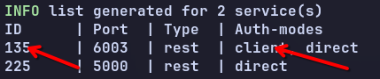
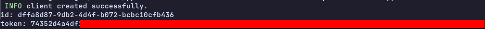

# Client Mode APIs
## Setting Up for Client Requests
This section shows how to connect to PPDRIVE in client mode. Before you start, please make sure a PPDRIVE service is running in [Client Mode](../../GETTING-STARTED.MD#21-client-mode) and you have the `ID` of the service. You can check running services with `ppdrive list` command and see `Auth-modes` column:



Once you confirm that a service is running in client mode and you have its `ID`, follow these steps:
1. Create a new client for the service:
```sh
ppdrive client create --svc-id [ID] --name [client_name]
```

  - `svc-id` is self-explanatory, right?
  - `name` is the name assigned to your client. Hint: Use a name you can easily associate with the client. For example, "Raymond Edutech App". Please note that `name` is required for creating a client but **not unique**.

  If the client is successfully created, the client's `id` and secret `token` would be printed like this:

  

2. After the client is created, copy and save token **securely** in your client application **<span color=red>TOKENS MUST BE KEPT SECRET!</span>** Do not expose your client token to public APIs. For example, you may save it in your environment variables:
```sh
PPD_TOKEN=74352d4a4df...
```

  If you think your token is compromised, you can refresh it with:
  ```sh
  ppdrive client refresh --svc-id [ID] --client-id [ID]
  ```

3. Add the token to `ppd-client-token` header and send requests to [available endpoints](#api-endpoints).
```js
const ppdToken = process.env.PPD_TOKEN;
const baseUrl = "0.0.0.0:5000" // or whatever location PPDRIVE is running from.

const resp = await fetch(`${baseUrl}/client/user`, {
    headers: {
        'Content-Type': 'application/json',
        'ppd-client-token': ppdToken
    }
})
```

## API Endpoints
These are the endpoints **currently available** on PPDRIVE client mode:

###### User Registration
**Endpoint:** /client/user/register

**Description**: Registers a new user for a client.

**Method:** POST

**Headers:**
  - `ppd-client-token` (_string_): The client's token

**Body:**
  - `max_bucket`:
    - required: `false`
    - type: `float64`
    - description: Total size of buckets the user can create in megabytes (MB). This is the total accumulated size, which means the user can create as many buckets as possible as long as the total size of all the buckets combined doesn't exceed this size. To put simply, this is **total filesize** this user can upload.
    
      When the option is not specified, user can create unlimited number of buckets and in turn, unlimited files.

**Response:**
  - type: `string`
  - description: Public ID (UUID) of the user created.
  
**Example:**
```js
const resp = await fetch(`${baseUrl}/client/user/register`, {
    method: 'POST',
    headers: {
        'Content-Type': 'application/json',
        'ppd-client-token': ppdToken
    },
    body: JSON.stringify({
      max_bucket: 10.0 // 10MB space assigned to the user
    })
})

console.log(resp.data) // 5c4699dc-476a-4133-af65-b799c09abb67
```

###### User Login
**Endpoint:** /client/user/login

**Description**: Autheticate a user with the given `id` and return authorization tokens. This endpoint is _mostly_ useful when your users to access PPDRIVE directly from the client side of your application. The returned auth token (JWT) can be added to `authorization` header in order to access "protected" routes directly. 

**Method:** POST

**Headers:**
  - `ppd-client-token` (_string_): The client's token

**Body:**
  - `id`:
    - required: `true`
    - type: `string`
    - description: ID of the user we wish to authenticate. The ID is returned when a [client registers new user](#user-registration).
  - `access_exp`:
    - required: `false`
    - type: `unsigned64`
    - description: How long it should take for returned `access` token to expire (in seconds).
  - `refresh_exp`:
    - required: `false`
    - type: `unsigned64`
    - description: How long it should take for returned `refresh` token to expire (in seconds).

**Response:**
  - type: `object`
    - `access`:
      - type: [`string`, `unsigned64`]
      - description: A 2-length-array where `first` element is access token and `second` element is access token expiration in seconds.
    - `refresh`:
      - type: [`string`, `unsigned64`]
      - description: A 2-length-array where `first` element is refresh token and `second` element is refresh token expiration in seconds.
  
**Example:**
```js
const resp = await fetch(`${baseUrl}/client/user/login`, {
    method: 'POST',
    headers: {
        'Content-Type': 'application/json',
        'ppd-client-token': ppdToken
    },
    body: JSON.stringify({
      id: '5c4699dc-476a-4133-af65-b799c09abb67'
    })
})

console.log(resp.data) 
// {
// "access":["eyJ0eXAiOiJKV1QiLCJhbGciOiJIUzUxMiJ9...",900],
// "refresh":["eyJ0eXAiOiJKV1QiLCJhbGciOiJIUzUxMiJ9...",86400]
// }
```

###### Delete User
**Endpoint:** /client/user/:id

**Description**: Deletes user with the given id.

**Method:** DELETE

**Headers:**
  - `ppd-client-token` (_string_): The client's token


**Response:**
  - type: `string`
  - description: A string that indicates that operation is successful.
  
**Example:**
```js
const resp = await fetch(`${baseUrl}/client/user/5c4699dc-476a-4133-af65-b799c09abb67`, {
    method: 'DELETE',
    headers: {
        'Content-Type': 'application/json',
        'ppd-client-token': ppdToken
    }
})

console.log(resp.data) // operation successful!
```

###### Create Client's Bucket
**Endpoint:** /client/bucket

**Description**: Create a [Bucket](../../TERMINOLOGIES.MD#bucket) for the client. 

**Method:** POST

**Headers:**
  - `ppd-client-token` (_string_): The client's token

**Body:**
- `label`:
    - required: `true`
    - type: `string`
    - description: A descriptive label for the bucket.
  - `root_path`:
    - required: `false`
    - type: `string`
    - description: If this option is specified, all [Assets](../../TERMINOLOGIES.MD#asset) uploaded to PPDRIVE will have paths relative to the specified path.
  - `size`:
    - required: `false`
    - type: `float64`
    - description: If specified, eqauls total size of [Assets](../../TERMINOLOGIES.MD#asset) that can be upload to the bucket. Think of this as an upload limit. It requires the `root_path` option to be set.
  - `accepts`:
    - required: `false`
    - type: `string`
    - description: The file mime type(s) that can be uploaded to the bucket. There different formats for specifying acceptable mime types:
      - `*` is the default and means all mime types are accepted.
      - `custom` means a selection of mimetypes manually specified by a user. Acceptable format should start with "custom" keyword followed by a colon ":" and comma seprated mimetypes. Example, `custom:application/zip,audio/3gpp`
      - You can specify a group of mimes using the `filetype` they belong to (e.g, "audio", "video", "application"...etc).
      - You can also specify a *list* of comma seprated groups e.g, "audio,video,application".
  `public`:
    - required: `false`
    - type: `boolean`
    - description: This will be the default vibility set for any asset uploaded to this bucket if no visibility is set for the asset.

**Response:**
  - type: `object`
    - `access`:
      - type: [`string`, `unsigned64`]
      - description: A 2-length-array where `first` element is access token and `second` element is access token expiration in seconds.
    - `refresh`:
      - type: [`string`, `unsigned64`]
      - description: A 2-length-array where `first` element is refresh token and `second` element is refresh token expiration in seconds.
  
**Example:**
```js
const resp = await fetch(`${baseUrl}/client/user/login`, {
    method: 'POST',
    headers: {
        'Content-Type': 'application/json',
        'ppd-client-token': ppdToken
    },
    body: JSON.stringify({
      id: '5c4699dc-476a-4133-af65-b799c09abb67'
    })
})

console.log(resp.data) 
// {
// "access":["eyJ0eXAiOiJKV1QiLCJhbGciOiJIUzUxMiJ9...",900],
// "refresh":["eyJ0eXAiOiJKV1QiLCJhbGciOiJIUzUxMiJ9...",86400]
// }
```
